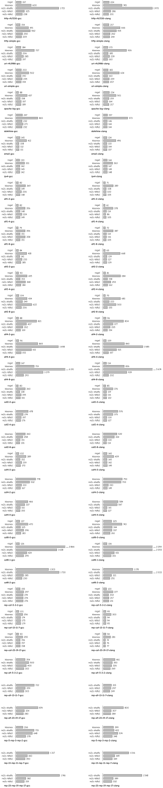
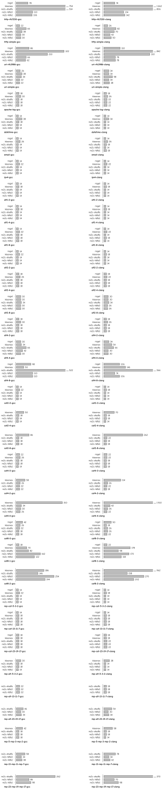
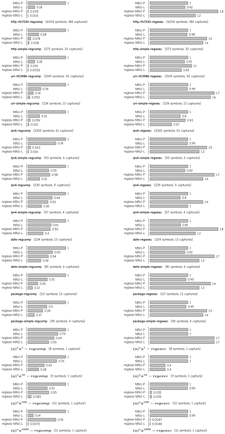

==========
Benchmarks
==========

.. toctree::
    :hidden:

Benchmarks are not built by default, as some of them contain large automata that
take considerable time to compile with GCC or Clang. To enable them, configure
with ``--enable-benchmarks`` (Autotools) or ``-DRE2C_BUILD_BENCHMARKS=yes``
(CMake). There are a few different groups of benchmarks.

Submatch extraction in lexer generators:

.. code-block:: bash

    $ cd ${BUILD_DIR}/benchmarks/submatch_dfa_aot
    $ ./run.py --repetitions ${REP_COUNT} --output=results.json

Submatch extraction in library algorithms based on deterministic automata:

.. code-block:: bash

    $ cd ${BUILD_DIR}/benchmarks/submatch_dfa_jit
    $ ./bench_submatch_dfa_jit --benchmark_out_format=json --benchmark_out=results.json

Submatch extraction in library algorithms based on non-deterministic automata:

.. code-block:: bash

    $ cd ${BUILD_DIR}/benchmarks/submatch_nfa
    $ ./bench_submatch_nfa --benchmark_out_format=json --benchmark_out=results.json

To generate a TeX bar chart (PGF plot) from the JSON output, use json2pgfplot.py
script. It has a few options, such as ``--relative-to <algo>`` (which scales the
timings relative to the specified algorithm) and ``--font <name>`` (which
specifies the font to be used).
The generated TeX file can be compiled to PDF, which can be further
converted to SVG, etc.

.. code-block:: bash

    $ ${SOURCE_DIR}/benchmarks/json2pgfplot.py results.json results.tex
    $ pdflatex results.tex </dev/null >results.log
    $ pdf2svg results.pdf results.svg

Submatch (lexer generators)
===========================

These benchmarks contain regular expressions with submatch markers that are
compiled to C code by a lexer generator, and further compiled to native code by
a C compiler (GCC and Clang). Compilation happens ahead of time, so it is not
included in the run time. The currently supported generators are
`ragel <https://www.colm.net/open-source/ragel>`_,
`kleenex <https://kleenexlang.org>`_
and re2c TDFA(0), TDFA(1) and sta-DFA algorithms (no flex, as it does not
support submatch extraction).
Regular expressions used in the benchmarks can be divided in two categories:

- real-world regular expressions (parsers for HTTP message headers, URI, email
  addresses, etc.) ranging from large to small, mostly unambiguous

- artificial regular expressions (a few different groups with emphasis on
  alternative, concatenation or repetition) in series of increasing complexity
  and ambiguity

The generated programs do string rewriting. They read text from stdin and write
it to stdout with some characters inserted at the points of submatch extraction
(this is to make sure that the generated program is correct). String rewriting
is a form dictated by kleenex, as it is suited to this task and cannot generate
free-form programs as ragel and re2c do. Both ragel and re2c programs are
written with performance in mind and use buffered input. As for kleenex, there
is no control over what it generates (user input consists of regular expressions
only), but presumably it also optimizes the generated code.

Ragel programs are fast, but not always correct. This is because ragel cannot
handle non-determinism in the general case. It is a fundamental limitation which
cannot be solved with disambiguation operators, except for simple cases. Ragel
has no notion of *tags* and *tag variables*, and its submatch extraction is
based on *actions* --- arbitrary blocks of code embedded in the regular
expression. When ragel generates a DFA, it puts actions either on transitions or
in states (depending on the action type). Non-determinism means that there are
multiple parallel NFA paths with different actions that reach a given DFA state.
Actions on different paths conflict with each other (in particular, an action
can conflict with itself) and change the program state in unforeseen ways (e.g.
overwrite variables set by another action). Disambiguation operators can remove
some of the conflicting actions, but they cannot fork the program state.

Kleenex generates very large automata in some benchmarks, which cannot be
compiled in reasonable time. On the whole, kleenex programs have some constant
overhead compared to other programs. It can be explained by a different
underlying automaton type (DSST), which is better suited to full parsing than
submatch extraction.

Of the algorithms in re2c, TDFA(1) is the fastest and the most robust one.
In unambiguous cases its performance is similar to ragel, sometimes slightly
better or worse (it varies more with the C compiler than with the benchmark).
The generated binary size is also close. In highly ambiguous cases TDFA(1) is
slower than ragel, which happens because TDFA(1) handles non-determinism by
keeping track of multiple possible tag values, while ragel doesn't handle it in
any special way.
TDFA(0) is generally less efficient than TDFA(1), see the paper `Tagged
Deterministic Finite Automata with Lookahead
</2017_trofimovich_tagged_deterministic_finite_automata_with_lookahead.pdf>`_
for a detailed comparison.
Sta-DFA performs well on small benchmarks, but it degrades quickly on large or
ambiguous regular expressions, both in speed and in the automaton size.

.. include:: submatch_dfa_aot/env.rst

Run time (milliseconds on 100MB text)
-------------------------------------

Binary size (stripped, kilobytes)
---------------------------------

Submatch (libraries, DFA)
=========================

This group contains library algorithms for submatch extraction that are based on
deterministic automata. These are regular expressions that undergo just-in-time
determinization before matching, which is included in the run time. Currently
the group contains only two algorithms, TDFA(1) and regless-TDFA(1) --- a
modification of TDFA(1) that replaces register operations with a record of tag
history, and a second pass on the history that unfolds it and reconstructs
submatch results. The benchmark also includes variations for POSIX and leftmost
greedy disambiguation policies, since disambiguation is also included in the run
time.

Regless-TDFA(1) bypasses a few expensive computation steps in *regcomp()*, which
results in much faster determinization times (a few orders of magnitude faster
on large regular expressions). For *regexec()* the results are divided: on
real-world regular expressions TDFA(1) usually outperforms regless-TDFA(1), but
in some artificially constructed cases it can arbitrarily slower. These are
pathological inputs for TDFA(1); the tags have arbitrarily high degree of
non-determinism (increased with the repetition counter), so TDFA(1) has to track
arbitrary many tag variables. Regless-TDFA(1) does not have tag variables.

.. include:: submatch_dfa_jit/env.rst

Determinization / run time (relative to first)
----------------------------------------------

Submatch (libraries, NFA)
=========================

This group contains library algorithms for submatch extraction based on
non-deterministic automata. They are described in depth in the paper `Efficient
POSIX submatch extraction on NFA
</2019_borsotti_trofimovich_efficient_posix_submatch_extraction_on_nfa.pdf>`_.
The goal is to compare algorithms that support POSIX longest-match semantics. A
few leftmost greedy algorithms are provided as a baseline, including the Google
RE2 library (which does not support POSIX semantics). There are four different
variations of Okui-Suzuki algorithm, an algorithm proposed by Kuklewicz and a
backward-matching algorithm proposed by Cox (which is generally incorrect).

As the benchmarks show, the basic Okui-Suzuki algorithm the most robust one
among POSIX algorithms. It works in bounded memory that depends only on the
regular expression and does not grow with the input size, and it has reasonable
performance compared to the leftmost-greedy algorithm (although it too has some
pathological cases on regular expressions with high ambiguity level). The lazy
variation of Okui-Suzuki algorithm is often faster, but its memory requirement
is not bounded (it grows with the size of input). Both Kuklewicz and backward
algorithms are much slower on large real-world regular expressions.

.. include:: submatch_nfa/env.rst

Simulation time (relative to first)
-----------------------------------

.. figure:: submatch_nfa/results_1.svg
    :class: benchmark

