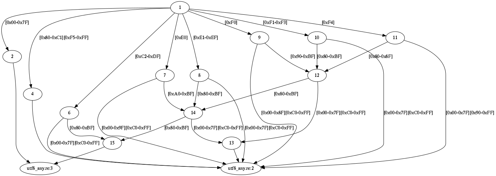
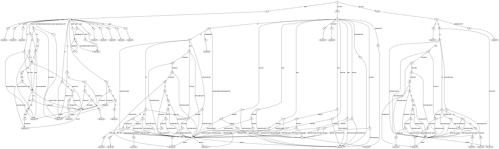
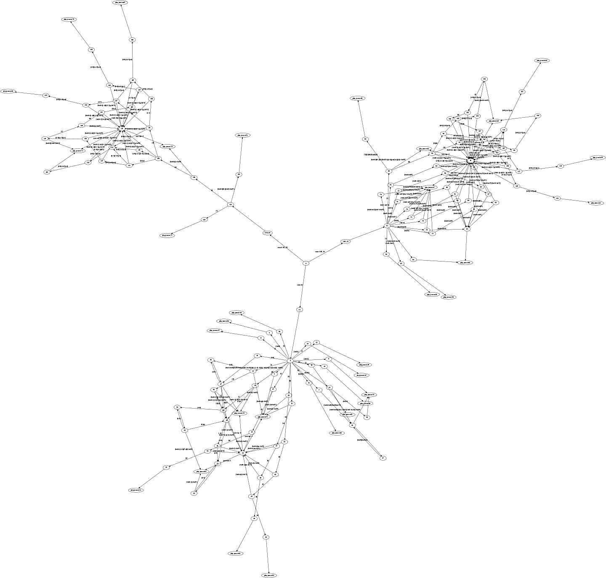

.dot
----

.. include:: ../home.rst

With ``-D, --emit-dot`` option re2c does not generate C/C++ code.
Instead, it dumps the generated DFA in `DOT format <https://en.wikipedia.org/wiki/DOT_%28graph_description_language%29>`_.
One can convert this dump to an image of DFA using `graphviz <http://www.graphviz.org/>`_ or another library.

Say we want a picture of DFA that accepts any UTF-8 code point:

.. include:: utf8_any.re
    :code: cpp
    :number-lines:

Generate and render :

.. code-block::

    $ re2c -D8 -o utf8_any.dot utf8_any.re
    $ dot -T png -o utf8_any.png utf8_any.dot

Here is the picture:



Note that re2c performs additional transformations on the DFA:
inserts ``YYFILL`` `checkpoints <../../../examples/example_02.html>`_,
binds actions, applies basic code deduplication.
During the transformations it splits certain states and adds lambda transitions.
Lambda transitions correspond to the unlabeled edges on the picture.

A real-world example (JSON lexer, all non-re2c code stripped out):

.. include:: php_json.re
    :code: cpp
    :number-lines:

Generate .dot file:

.. code-block::

    $ re2c -Dc -o php_json.dot php_json.re

Render with ```dot -G ratio=0.3 -T png -o php_json_dot.png php_json.dot```:



Render with ```neato -E len=4 -T png -o php_json_neato.png php_json.dot```:



The generated graph is sometimes very large and requires careful tuning of rendering paratemeters.


