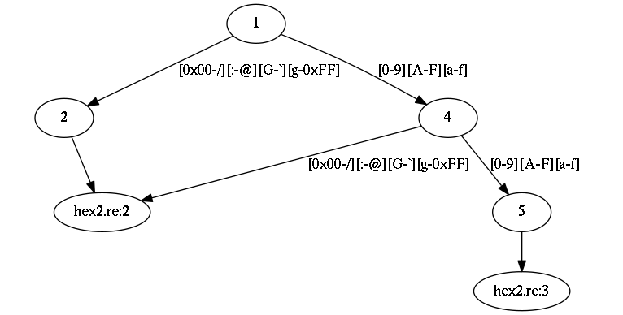

Example
~~~~~~~

`[hex2.re] <hex2.re>`_

.. include:: hex2.re
    :code: c
    :number-lines:

Here is a very simple program (it tries to match two-digit hexadecimal numbers).
We can see the generated DFA using ```re2c -D hex2.re | dot -Gratio=0.5 -Tpng -o example.png```:



Given this program, ```re2c -S -o example.c hex2.re``` generates three files:
``example.c`` (main program), ``example.c.line4.input`` (input data) and ``example.c.line4.keys`` (expected match results).
First, let's look at the generated strings:

`[example.c.line4.input] <example.c.line4.input>`_

.. code-block:: bash

    $ hexdump -C example.c.line4.input
    00000000  00 2f 3a 40 47 60 67 ff  30 30 30 39 30 41 30 46  |./:@G`g.00090A0F|
    00000010  30 61 30 66 39 30 39 39  39 41 39 46 39 61 39 66  |0a0f90999A9F9a9f|
    00000020  41 30 41 39 41 41 41 46  41 61 41 66 46 30 46 39  |A0A9AAAFAaAfF0F9|
    00000030  46 41 46 46 46 61 46 66  61 30 61 39 61 41 61 46  |FAFFFaFfa0a9aAaF|
    00000040  61 61 61 66 66 30 66 39  66 41 66 46 66 61 66 66  |aaaff0f9fAfFfaff|
    00000050  30 00 30 2f 30 3a 30 40  30 47 30 60 30 67 30 ff  |0.0/0:0@0G0`0g0.|
    00000060  39 00 39 2f 39 3a 39 40  39 47 39 60 39 67 39 ff  |9.9/9:9@9G9`9g9.|
    00000070  41 00 41 2f 41 3a 41 40  41 47 41 60 41 67 41 ff  |A.A/A:A@AGA`AgA.|
    00000080  46 00 46 2f 46 3a 46 40  46 47 46 60 46 67 46 ff  |F.F/F:F@FGF`FgF.|
    00000090  61 00 61 2f 61 3a 61 40  61 47 61 60 61 67 61 ff  |a.a/a:a@aGa`aga.|
    000000a0  66 00 66 2f 66 3a 66 40  66 47 66 60 66 67 66 ff  |f.f/f:f@fGf`fgf.|
    000000b0

Byte sequences correspond to the paths in DFA.
All strings are glued together, so it's hard to tell where is the end of one string and the beginning of another.
For that re2c generates keys:

`[example.c.line4.keys] <example.c.line4.keys>`_

.. code-block:: bash

    $ hexdump -v -e '"%04_ax| " 24/1 "%02x " "\n"' example.c.line4.keys 
    0000| 01 01 fe 01 01 fe 01 01 fe 01 01 fe 01 01 fe 01 01 fe 01 01 fe 01 01 fe
    0018| 02 02 00 02 02 00 02 02 00 02 02 00 02 02 00 02 02 00 02 02 00 02 02 00
    0030| 02 02 00 02 02 00 02 02 00 02 02 00 02 02 00 02 02 00 02 02 00 02 02 00
    0048| 02 02 00 02 02 00 02 02 00 02 02 00 02 02 00 02 02 00 02 02 00 02 02 00
    0060| 02 02 00 02 02 00 02 02 00 02 02 00 02 02 00 02 02 00 02 02 00 02 02 00
    0078| 02 02 00 02 02 00 02 02 00 02 02 00 02 01 fe 02 01 fe 02 01 fe 02 01 fe
    0090| 02 01 fe 02 01 fe 02 01 fe 02 01 fe 02 01 fe 02 01 fe 02 01 fe 02 01 fe
    00a8| 02 01 fe 02 01 fe 02 01 fe 02 01 fe 02 01 fe 02 01 fe 02 01 fe 02 01 fe
    00c0| 02 01 fe 02 01 fe 02 01 fe 02 01 fe 02 01 fe 02 01 fe 02 01 fe 02 01 fe
    00d8| 02 01 fe 02 01 fe 02 01 fe 02 01 fe 02 01 fe 02 01 fe 02 01 fe 02 01 fe
    00f0| 02 01 fe 02 01 fe 02 01 fe 02 01 fe 02 01 fe 02 01 fe 02 01 fe 02 01 fe
    0108| 02 01 fe 02 01 fe 02 01 fe 02 01 fe                              

A key is a triplet: string length, the length of matching prefix and the number of matching rule.
All three components occupy equal amount of memory (re2c uses unsigned integer type of minimal sufficient width).
Keys are packed into array of length ``3 * n`` (where ``n`` is the number of keys).
In our case each triplet occupies three bytes.

And finally, the program itself:

`[example.c] <example.c>`_

.. include:: example.c
    :code: c
    :number-lines:

re2c generated two auxilary functions: ``read_file`` and ``action_line4``.
``read_file`` is used to map ``.input`` and ``.keys`` files into memory (this function is shared between all lexers).
``action_line4`` is a replacement for actions: it compares actual lexing results with the expected results.
This function is specific to each lexer.
Lexing is done by ``lex_line4``: this function contains the generated DFA.
``main`` simply calls the lexer.

Compile and run:

.. code-block:: bash

    $ gcc -o example example.c
    $ ./example
    $ echo $?
    0

When everything is fine, the program outputs nothing and exits with zero.


