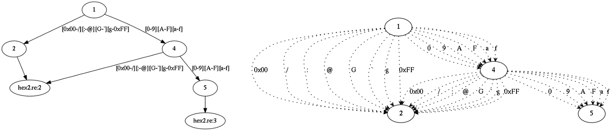
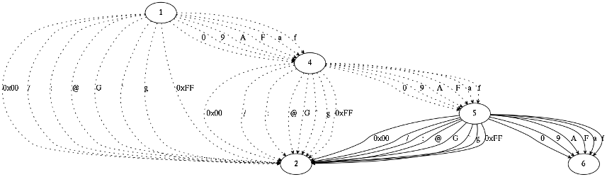
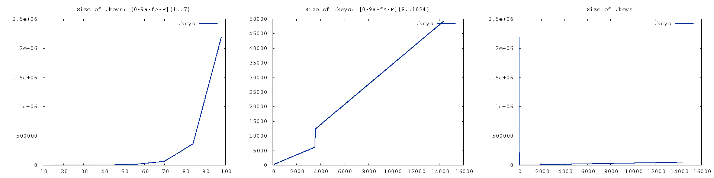
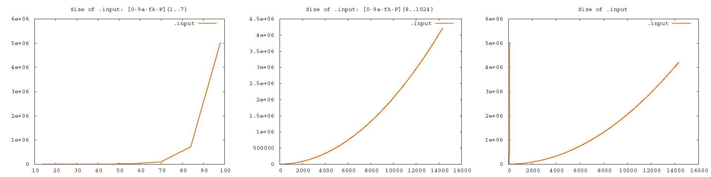

Generating data
~~~~~~~~~~~~~~~

One cannot just run lexer on all possible inputs:
for an alphabet of ``n`` characters and input length ``m``, the number of input strings is ``n`` to the power of ``m``.

The problem can be mitigated by tailoring the set of input strings to a particular lexer.
For most lexers only a small subset of all input strings makes sense: the majority of them are ill-formed.
Ill-formed inputs are rejected after the first few characters, so that remaining characters are insignificant:
lexer will never reach them and they can be as well discarded.
Input strings that differ only in discarded suffixes are collapsed into one.
This reduces the overall number of strings greatly.

Still the number of inputs is too large.
We can further reduce it by collapsing disjoint character sets:
for each each character range we only take its boundaries.
This cuts off many interesting well-formed inputs, but we have to give up some of them this way or another.
The graph from the example above results into the following residual DFA:

All further algorithms work with the residual graph.
re2c has two algorithms:

* First algorithm generates all possible paths from start node to end nodes
  by performing deep-first search on graph (loops are iterated once).
  The number of input strings grows exponentially with the number of edges,
  thus the algorithm is only suitable for small graphs and graphs with loosely connected nodes.

* Second algoritm constructs path cover: a set of paths from start node to end nodes
  such that each edge in graph is covered by at least one path.
  The number of generated strings is bounded by the number of edges in graph.
  However, the total length of the generated strings depends quadratically on the number of edges.
  (An example of quadratic dependency is shown below.
  Upper bound follows from the fact that total length cannot exceed the number of strings
  times maximal string length, both values obviously bounded by the number of edges.)

re2c proceeds as follows: first, it estimates the amount of data needed to generate all paths
(estimation can be done in linear time).
If it exceeds certain limit (~32Mb edges), re2c fallbacks to path cover (which is limited by ~1Gb of edges).
Both algorithms are implemented so that they consume constant amount of RAM
(they dump data to file as soon as it is generated).

We can look at both algorithms in action on the same example, simply alternating repetition counter:

.. code-block:: cpp
    :number-lines:

    /*!re2c
        *              {}
        [0-9a-fA-F]{1} {} // [0-9a-fA-F]{2}, [0-9a-fA-F]{3}, [0-9a-fA-F]{4}, ...
    */

Each increment of the repetition counter adds 14 new edges to the residual DFA.
For example, here is a picture of DFA with three repetitions
(compare it with the above picture of two repetitions — edges in bold have been added):

The following script shows how ``.input`` and ``.keys`` file size depends on the number of edges in graph:

`[gen.sh] <gen.sh>`_

.. include:: gen.sh
    :code: bash
    :number-lines:

It expects two arguments: lower and upped bounds of the iteration counter.
From the example output we can see that for counter values 1 through 7 re2c generated all paths,
then it switched to path cover:

.. code-block::

    $ ./gen.sh 1 16
         iters     edges     input      keys
    
             1        14        14        42
             2        28       176       276
             3        42      1616      1680
             4        56     13064     10104
             5        70     98600     60648
             6        84    712904    363912
             7        98   5005256   2183496
             8       112       336       210
             9       126       414       234
            10       140       500       258
            11       154       594       282
            12       168       696       306
            13       182       806       330
            14       196       924       354
            15       210      1050       378
            16       224      1184       402

The following pictures show how ``.keys`` file size depends on the number of edges.
Total size of keys equals size of a single key times the number of generated strings.
On the 1st plot (repetitions 1 through 7) it grows exponentially.
On the 2nd plot (repetitions 8 through 1024) it grows linearly (the change of angle
is due to the change of key size: starting from repetition count 256 path length gets out of 1-byte range).
The 3rd plot shows the relation between 1st and 2nd plots.

Size of ``.input`` grows exponentially (repetitions 1 through 7) and quadratically (repetitions 8 through 1024).
The exact quadratic function is ``f(x) = 4x^2+ 10x``, where ``x`` is the repetition counter.
However, graphs like this rarely occur in practice: maximal path length is usually less than a hundred.

