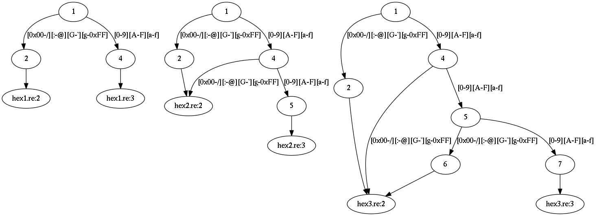
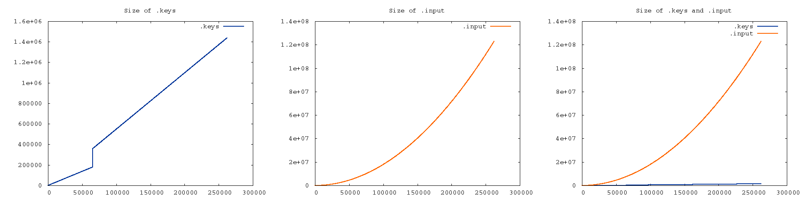

Generating data
~~~~~~~~~~~~~~~

One cannot just run lexer on all possible inputs:
for an alphabet of ``n`` characters and input length ``m``, the number of input strings is ``n`` to the power of ``m``.
The problem can be mitigated by tailoring the input for a particular lexer.

First, re2c constructs skeleton of the given DFA.
For encodings with 1-byte code units skeleton is an exact copy of the original DFA.
For encodings with multibyte code units skeleton is a copy of DFA with certain edges omitted:
for each continuous range of code units (that corresponds to a set of edges between two DFA states)
re2c takes at most 256 code units.
The chosen values are evenly distributed and include range bounds.
(In case of 1-byte code units 256 values are enough to cover the whole range.)

Second, instead of trying to cover all possible inputs, re2c generates skeleton path cover:
a set of paths from start node to end node such that each skeleton edge is covered by at least one path.
The number of paths in path cover is bounded by the number of edges in skeleton.
However, the total size of path cover depends quadratically on the number of edges:
an example is shown below and
upper bound follows from the fact that total size is bounded by the number of paths
times maximal path length, both values obviously bounded by the number of edges.

The algorithm's implementation is limited by ~1Gb of edges and consumes constant amount of RAM
(re2c dumps data to file as soon as it is generated).
We can study the algorithm simply alternating repetition counter in the example above:

.. code-block:: cpp

    /*!re2c
        *              {}
        [0-9a-fA-F]{1} {} // [0-9a-fA-F]{2}, [0-9a-fA-F]{3}, [0-9a-fA-F]{4}, ...
    */

Each increment of the repetition counter adds 256 new edges the DFA.
Compare the following pictures of DFA with one, two and three repetitions:

We will use a simple script that dumps re2c source file,
generates skeleton program and measures the size of ``.input`` and ``.keys`` files:

:download:`[gen.sh] <gen.sh.txt>`

.. literalinclude:: gen.sh.txt
    :language: bash
    :linenos:

Script runs in a loop and expects two arguments:
lower and upped bounds of the iteration counter.

.. code-block:: none

    $ ./gen.sh 1 16
         iters     edges     input      keys
    
             1       256       256       768
             2       512       746      1470
             3       768      1470      2172
             4      1024      2428      2874
             5      1280      3620      3576
             6      1536      5046      4278
             7      1792      6706      4980
             8      2048      8600      5682
             9      2304     10728      6384
            10      2560     13090      7086
            11      2816     15686      7788
            12      3072     18516      8490
            13      3328     21580      9192
            14      3584     24878      9894
            15      3840     28410     10596
            16      4096     32176     11298

The following pictures show how ``.keys`` and ``.input`` file size depends on the number of edges
(repetition counters 1 through 1024):

Keys grow linearly with the number of edges in skeleton (a key corresponds to a single path in path cover).
The change of angle is due to the change of key size:
starting from repetition count 256 path length gets out of 1-byte range.

Size of input grows quadratically with the number of edges in skeleton.
We can calculate the exact analythic function as follows.
Each repetition increment adds 256 new edges: 22 edges corresponding to ``[0-9a-fA-F]`` that
go to accepting state and 234 remaining edges that go to default state.
With a bit of common sense (or knowledge of re2c algorithm)
one can see that path cover must include 22 paths of length ``n`` (that go to accepting state)
plus all the default paths (234 paths of lenght 1, plus 234 paths of length 2 
and so on up to 234 paths of length ``n``):

::

    22*1 + 234*1
    22*2 + (234*1 + 234*2)
    22*3 + (234*1 + 234*2 + 234*3)
    ...
    f(n) = 22*n + (234*1 + 234*2 + ... + 234*n)
         = 22*n + 234*n*(n - 1)/2
         = 117*n^2 + 139*n

However, in practice maximal path length is usually less than a hundred
and the size of ``.input`` files is quite acceptable even for large graphs.

